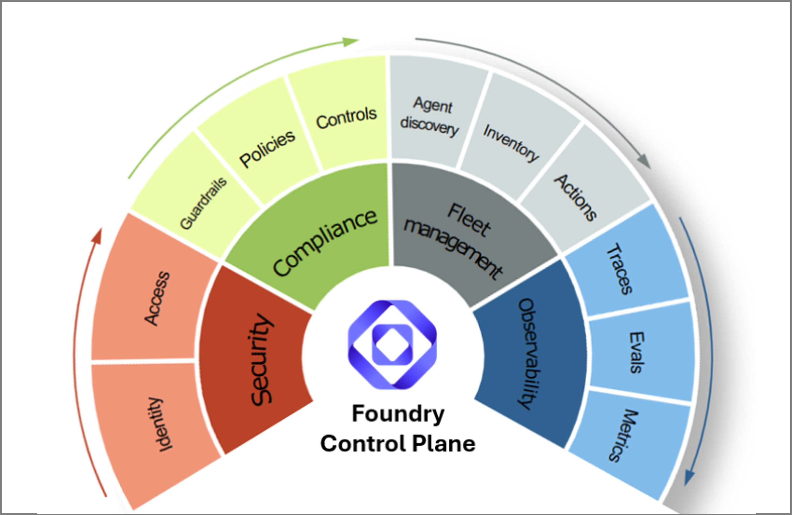

# Microsoft Foundry AI Agent オブザーバビリティ・ワークショップ

## セッション概要

このワークショップでは、Microsoft Foundry オブザーバビリティプラットフォームを体験します:

## アプリケーションシナリオ

すべてのラボを通じて共通のシナリオを使用します。これにより、実際のユースケースの文脈で機能や成果を考えることができます。

**Contoso Travel** は架空の中規模旅行代理店です。人間のアドバイザーチームが旅行予約に関する顧客からの問い合わせ量に対応しきれなくなっています。彼らには AI を活用した旅行アシスタント—関連する在庫（ホテル、フライト、レンタカーなど）を検索してパーソナライズされた提案を行い、複数ターンの会話でカスタマイズされた旅程を提供できるインテリジェントエージェントのシステム—が必要です。

## ワークショップ概要

このワークショップでは、AI 開発者の旅路を _計画_ から _プロトタイピング_ を経て _本番_ まで追います。ワークショップ終了時には、次のことができるようになります:

1. OpenTelemetry トレースでエージェントの実行を _観察_ する
1. 評価結果に基づいてエージェントのパフォーマンスを _最適化_ する
1. レッドチーミングスキャンで攻撃からエージェントを _保護_ する
1. エージェントを _デプロイ_ し、Ask AI でインサイトを監視・分析する

Microsoft Foundry プラットフォームのツールとワークフローを使用して、これらを実現します。ワークショップ終了時には、次のことができるようになります:

1. コードなしでシングルプロンプトエージェントを _セットアップ_ する - [Foundry ポータル](https://learn.microsoft.com/en-us/azure/foundry/how-to/navigate-from-classic?view=foundry#navigate-the-portal)を使用
1. マルチエージェントソリューションをコードファーストで _構築_ する - [Foundry SDK](https://learn.microsoft.com/en-us/azure/foundry/how-to/develop/sdk-overview?view=foundry&pivots=programming-language-python)を使用

 

### 関連リソース

Microsoft _Foundry コントロールプレーン_ は、エージェント AI ソリューションのセキュリティ・コンプライアンス・フリート管理・オブザーバビリティをサポートするツールと機能を提供します。Microsoft Foundry ポータルの「Operate」タブからアクセスできる統合されたロールベースの管理インターフェースも備えています。

このワークショップではオブザーバビリティにスポットを当てていますが、以下のリソースも活用してさまざまなコンポーネントについて深く学ぶことをお勧めします。

| リソース | 説明 |
|----------|-------------|
| [Foundry Control Plane](https://learn.microsoft.com/en-us/azure/foundry/control-plane/overview?view=foundry) | AI エージェント・モデル・ツールのエンタープライズ全体の可視性、ガバナンス、制御 |
| [Observability](https://learn.microsoft.com/en-us/azure/foundry/concepts/observability?view=foundry) | AI エージェントの監視、理解、トラブルシューティング |
| [Agent tracing](https://learn.microsoft.com/en-us/azure/foundry/observability/concepts/trace-agent-concept?view=foundry) | Foundry での OpenTelemetry (OTel) プロトコルとセマンティック規約のサポート |
| [Evaluators](https://learn.microsoft.com/en-us/azure/foundry/concepts/built-in-evaluators?view=foundry) | 品質・安全性・エージェントパフォーマンスのための組み込みおよびカスタム評価項目 |
| [Red Teaming](https://learn.microsoft.com/en-us/azure/foundry/concepts/ai-red-teaming-agent?view=foundry) | 特定リスクカテゴリと攻撃戦略に対する敵対的テスト |
| | |

 
 
 
## 謝辞

このワークショップは [microsoft-foundry-e2e-agent-observability-workshop](https://github.com/Azure-Samples/microsoft-foundry-e2e-agent-observability-workshop/tree/main) を短時間で体験できるようにアレンジし、カスタム評価項目（lab-06）を追加したものです。

